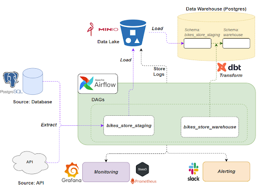
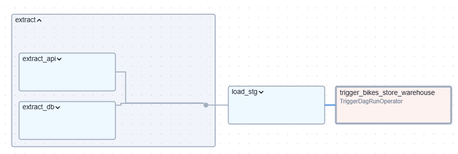
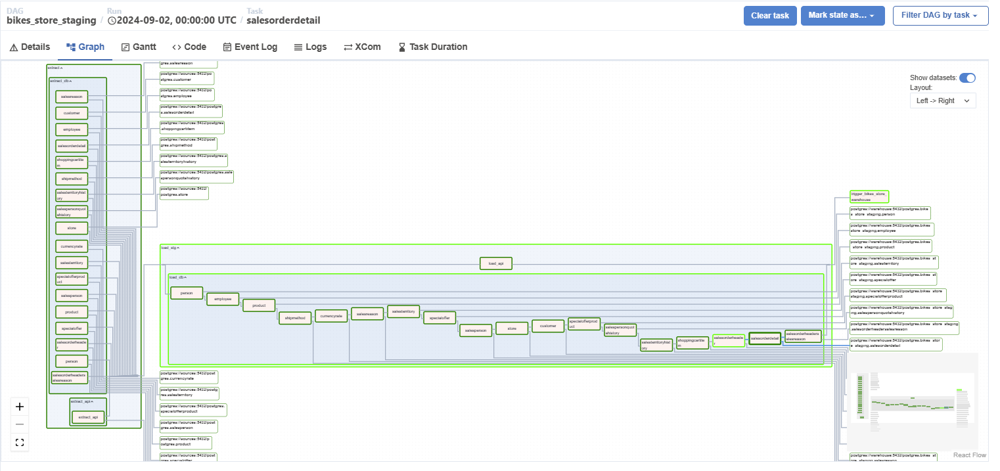
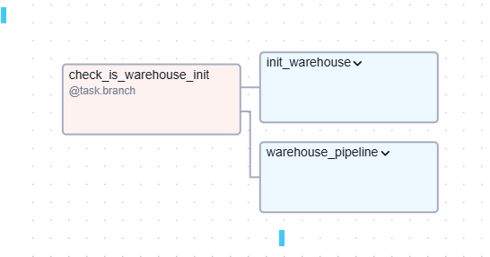
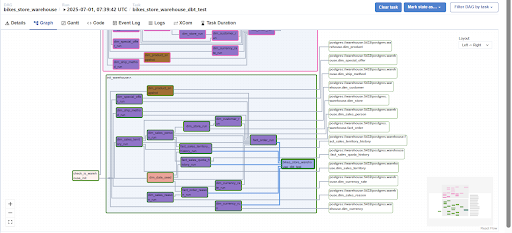
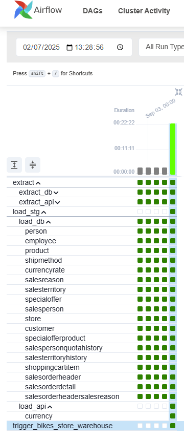
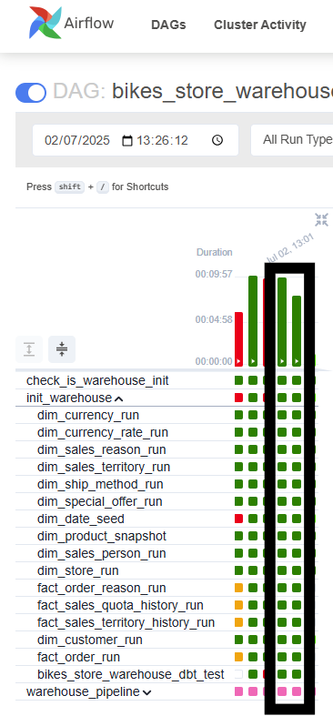
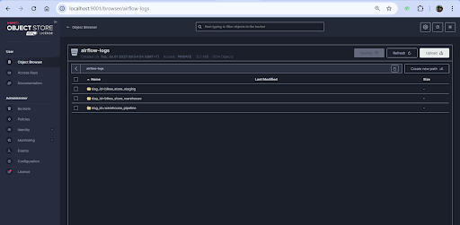
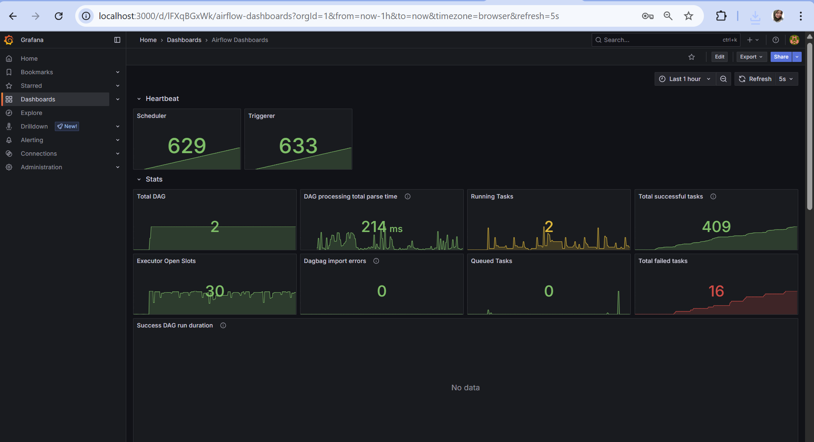
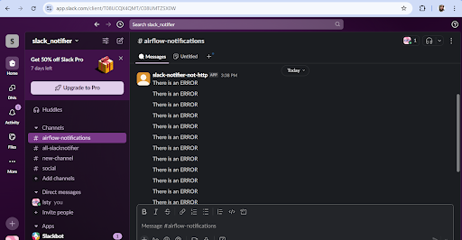

## Project Overview 

This project orchestrated an automated data pipeline that Extract Data from Data Source, Load to Data Staging and Transform the data to Data Warehouse. 
The case is about Bikes Store, a global manufacturer and retailer of bicycles, components, and accessories, aims to gain actionable insights into its operations and sales performance, Their analysis need to handle data from multiple sources such as databases, and APIs. Therefore, they need data warehouse to store all of their data, accesible for every department in the company to use.


# Architecture Description
- Docker: a containerization platform, used to manage and deploy data pipelines and applications. Services composed: airflow, Posgres as Data Source, Posgres as Data Warehouse and MinIO.
- Minio: MinIO as data Lake. stored data extracted from data source before processed to data warehouse.
- PosgreSQL: Data source is simulated and pre-loaded as part of the Docker setup. PostgreSQL also used as datawarehouse 
- Airflow: Apache Airflow is used for the scheduling and orchestration of data pipelines or workflows. Airflow Version -> 2.10.2  Executor ->  Celery Executor Additional Requirements ->  'astronomer-cosmos[dbt.postgres]'
- Dbt: Used for Transform the staging data into dimensional and fact tables 


## Pipeline Flow



Flow of Data Pipeline tasks that would be performed are:
- Extract: Extract data from data source (postgresSQL) and API source then dump it to object storage (minio)
- Load: Extract data from minio object storage and upsert into a staging database (postgreSQL)
- Transform: Transforming data from staging data to datawarehouse, using DBT

## Directed Acyclic Graphs (DAGs)

There are 2 DAG's:
- bikes_store_staging

  This DAG explain process extracting and loading to Data Staging. There are 3 main taskgroups: Extract  >> Load >> Trigger DAG Data Warehouse. 
  - Extract Task Groups
    Consists 2 Task Groups: 
      - Extract from postgres database: extracting data from the transaction database and be saved as a csv file in MinIO (bikes-store bucket). The data extraction process can be done incrementally (daily) or not and run in parallel (simultaneously).
      - Extract from API: extracting data from API and be saved as a csv file in MinIO (bikes-store bucket). The data extraction process can not be done incrementally (daily)
  - Load Task Groups:  loading data from the API that has been stored as a csv file in MinIO (bikes-store bucket) to the staging schema in the warehouse. Loading process of the data can pe processes incrementally, except for data currency.csv (from API) can not be done incrementally.
  - Trigger DAG run Task: Trigger the bikes_store_datawarehouse to run
  All the Task(s) have outlets (store information where the data is stored)
  

- bikes_store_datawarehouse
This DAG explain process extracting and loading to Data Staging. There are 3 main taskgroups:
  

  - check_is_warehouse_init: This is a task branch, to check a variable, before continuing to next TaskGroups. If the variable is True, the process continue to init_warehouse task groups, the warehouse_pipeline will be skipped, and vice versa
  - init_warehouse: Task using dbt for transforming data to datawarehouse. If variable is_init True, this task group would be run. 
  - warehouse_pipeline: Task using dbt for transforming data to datawarehouse. If variable is_init False, this task group would be run. This task excluding task seed on dbt. 
  All the Task(s) have outlets (store information where the data is stored)
  


## How to use this project? (preparations)

### 1. Preparations
- **Clone repo** :
  ```
  git clone https://github.com/istywhyerlina/airflow-dbt-bikestore.git
  ```

-  **Create env file** in project root directory  (Fill in the .env copy file, rename it as .env)
-  Run fernet.py, copy the code as  AIRFLOW_FERNET_KEY in env file
### 2. Run setup sh in the root project:
  ```
  ./setup.sh
  ```

 
### Set up a Slack Notifier

Before importing variables, we need to set up the slack-notifier with SLACK. Step by step for making slack-notifier variable:
- Create workspace 
- [https://api.slack.com/apps](https://api.slack.com/apps)
- create new app 
- chose the workspace, follow the instructions
- Go to Features, OAuthPermissions, add scopes chat:write.public
- Copy Bot User OAuth Token variabe files

## Screenshot of Task
- Run DAG
  
  
- Logs in Minio
  
- Monitoring AIrflow with Grafana
  
- Slack Notifier
  


